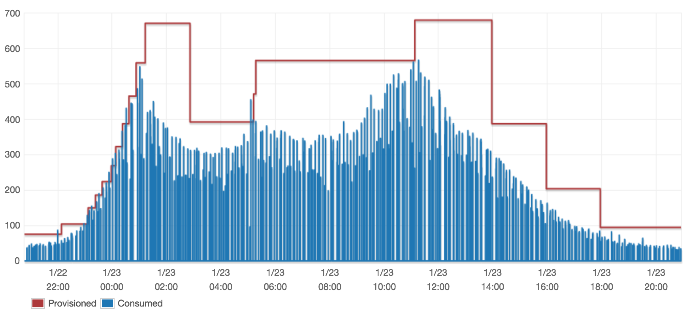

# Auto-Tune DynamoDB

`autotunedynamodb` is an AWS Lambda that tunes AWS DynamoDB read and write capacity by monitoring consumed capacity statistics. This can
significantly reduce you AWS bill and improve response times during traffic spikes. It can publish adjustment
notifications to [Slack](https://slack.com) for testing and monitoring. Use
[`node-lambda`](https://www.npmjs.com/package/node-lambda) to run, package, and deploy `autotunedynamodb`.

## Features

* Scale up and down DynamoDB read/write capacity automatically.
* Works with DynamoDB tables and secondary indexes.
* Can publish adjustment notifications and errors to [Slack](https://slack.com)
* Adjustable hot and cold capacity consumption threshold so you can tune how aggressively capacity is adjusted.
* Adjustable warm up and cool down periods so you can tune how frequently capacity is adjusted.
* Adjustable decrease cool down period after increase allows you to adjust how aggressively capacity is decreased after
 an increase.
* Adjustable min and max capacity limits.
* Simple deployment only requires AWS Lambda and CloudWatch.

# Settings

| Setting                          | Type   | Description |
| ---                              | ---    | ---         |
| COLD_THRESHOLD_RATIO             | float  | Ratio of consumed/total capacity that will trigger a decrease |
| HOT_THRESHOLD_RATIO              | float  | Ratio of consumed/total capacity that will trigger a increase |
| COOLDOWN_PERIOD_MINUTES          | int    | Number of minutes to wait after decrease before decreasing again |
| WARMUP_PERIOD_MINUTES            | int    | Number of minutes to wait after increase before increasing again |
| INCREASE_TO_DECREASE_MIN_MINUTES | int    | Number of minutes to wait after increase before decreasing |
| MIN_CAPACITY                     | int    | Minimum capacity |
| MAX_CAPACITY                     | int    | Maximum capacity |
| SLACK_HOOK_URL                   | string | A slack web hook |
| CONSUMPTION_STATISTICAL_PERIOD_MINUTES | int | minutes of CloudWatch metrics to analyze |

# Example

The following shows `autotunedynamodb` in action. The chart shows DynamoDB write throughput and capacity over time
while `autotunedynamodb` is running once per minute with the following settings:

* COLD_THRESHOLD_RATIO = 0.5
* HOT_THRESHOLD_RATIO = 0.95
* COOLDOWN_PERIOD_MINUTES = 120
* WARMUP_PERIOD_MINUTES = 1
* INCREASE_TO_DECREASE_MIN_MINUTES = 30

## Setup

1. Fork this repo
1. Clone your fork
1. Run `npm install`

## Run Locally

Run your Amazon Lambda index.js file locally.

1. Run `node_modules/node-lambda/bin/node-lambda run`

## Package

Bundle into a local zip file.

1. Run `node_modules/node-lambda/bin/node-lambda package`

## Deploy

Deploy to Amazon Lambda.

1. Run `node_modules/node-lambda/bin/node-lambda deploy`
1. Set the Lambda function `Role`. Create a new role as needed. See [Example Policy](#example-policy)
1. Set SLACK_HOOK_URL environment variable (optional) to a web hook generated by [Slack](https://slack.com).

### Example Policy

This is an example AWS IAM Role Policy for `autotunedynamodb` Lambda function. This policy allows the function to list,
describe, and update all DynamoDB tables. It allows the function to get CloudWatch metrics statistics. It allows the
function to create log groups, create log streams, and put log events in CloudWatch Logs.

    {
      "Version": "2012-10-17",
      "Statement": [
        {
          "Action": [
            "dynamodb:ListTables",
            "dynamodb:DescribeTable",
            "dynamodb:UpdateTable",
            "cloudwatch:GetMetricStatistics",
            "logs:CreateLogGroup",
            "logs:CreateLogStream",
            "logs:PutLogEvents"
          ],
          "Effect": "Allow",
          "Resource": "*"
        }
      ]
    }

## Create AWS CloudWatch Rule

Use a CloudWatch Rule to publish scheduled events to autotunedynamodb.

1. Open CloudWatch console
1. Create Rule
1. Choose `Scheduled`
1. Choose `Fix rate of`, `1`, `Minutes`
1. Add target `Lambda function`, `autotunedynamodb`

# License

This is software is licensed under The MIT License (MIT). Copyright &copy; 2017 MobileRQ, Inc. [Full license](LICENSE)
in root of this source tree.